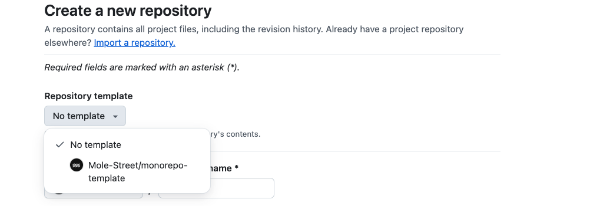

# Mole Street Monorepo Template Repository

The [monorepo-template repository](https://github.com/Mole-Street/monorepo-template) is the central codebase template for all projects at Mole Street, organized as a monorepo to consolidate frontend and backend projects into one location. It includes zsh scripts to quickly scaffold new projects, whether they are frontend themes, CMS React apps, HubSpot Serverless Functions or Custom Integrations. The script sets up the necessary files and configurations, allowing you to get started quickly while maintaining a consistent structure across all projects.

## Table of Contents

1. [Creating a New Project](#creating-a-new-project)
2. [Supported Project Types](#supported-project-types)
3. [Monorepo Overview](#monorepo-overview)
4. [GitHub Template Repo Overview](#github-template-repo-overview)
5. [Linting and Formatting](#linting-and-formatting)
6. [Reporting a Bug](#reporting-a-bug)
7. [Requesting a New Feature](#requesting-a-new-feature)
8. [Updating the Script Source Code](#updating-the-script-source-code)
9. [Coming Soon](#coming-soon)

## Creating a New Project

### 1. Create a New Repo Using the Monorepo Template

To create a new repo based on the existing Mole Street monorepo template, you can use GitHub's template feature to easily create a new repository. Simply select `Mole-Street/monorepo-base` from the repository template dropdown. This will copy all of the files from the template repo into your new repo.



Note: reference our [GitHub Guidelines](https://docs.google.com/document/d/1lq-WjHNMK0TS95btAACO9VUMY5rFndw8pitKeCs2jzg/edit?tab=t.0#heading=h.al0d2odtj7to) for our repo naming convention

### 2. Install Shared Dependencies

After creating the new repository, you'll need to install the shared dependencies and set up npm workspaces. This ensures that all projects within the monorepo can share common dependencies, run linting and formatting tools, and leverage workspaces for efficient dependency management. Navigate to the Root of the repo and run `npm install`.

#### NPM Workspaces

[Workspaces](https://docs.npmjs.com/cli/v7/using-npm/workspaces) in npm allow you to manage shared dependencies in a root package.json. This monorepo setup uses workspaces to handle both frontend and backend projects separately (in frontend/_ and backend/_), while maintaining a single node_modules directory for shared dependencies across all project types at the root of the repo. This removes the need to install the same dependency multiple times, ensuring consistency.

In the root package.json, the workspaces feature is defined as:

```json
"workspaces": [
  "frontend/*",
  "backend/*"
]
```

**Shared dependencies:**

- @hubspot/cli
- @hubspot/api-client
- axios
- eslint
- prettier
- stylelint

### 2. Run the Project Setup Script (Create a New Project)

Navigate to the root of the repository and run the following command in your terminal:

      ./scripts/create-project.sh

**Project Setup Steps**:

1.  **Select Project Type**: The script will prompt you to choose whether you're creating a frontend or backend project.
2.  **Enter Project Information**: Some project types will prompt you for additional details, such as the project name. The script will validate the name to ensure it doesn't conflict with an existing project.
3.  **Project Scaffolding**: The script will:
    - Create the necessary folder structure for your project.
    - Copy predefined files from the assets directory into the new project.
    - Replace placeholders in files like package.json with your project name.
    - Create the following files:
      - `README.md`: Contains instructions on running the project locally, syncing with HubSpot, and other relevant project-specific information.
      - `package.json`: Manages project-specific dependencies, scripts, and versioning.

### 3. Update the README.md file at the root of the repo

If creating a new repo for the first time, update the h1 with the client name and comment in the corresponding project type under the h2.

When adding a new project to an existing repo, comment in the corresponding project type under the h2.

## Supported Project Types

The scaffolding script supports the following project types. For any other project types, consider adding a new script to the template repo.

### Frontend

#### Themes

For building HubSpot themes. The script sets up the folder structure, config files, and template code. One project instance is allowed per theme type in a repo:

- Website
- Quotes
- Emails
- Membership Portal
- Blog

#### CMS React Apps

For building React-based frontend applications that integrate with the HubSpot CMS. The script sets up the React project, scaffolds components, and configures the build files. Multiple React apps can exist within a single repository—run the script for each new React app.

### Backend

#### HubSpot Serverless Functions

For building serverless functions interacting with HubSpot and third-party services. The script scaffolds the function files and necessary HubSpot configurations. Multiple functions can exist within the same repo by running the script for each new function.

#### AWS Lambda Functions

For building Lambda functions on AWS. The script scaffolds the function files and the package.json. Multiple Lambda functions can be created within a single repo—run the script each time you need a new Lambda function.

#### Azure Functions

For building Azure serverless functions. The script sets up the function files and package.json. Multiple Azure functions can be created in a single repo by running the script for each new function.

#### HubSpot UI Extensions

For building HubSpot UI extensions in the CRM using React. The script creates the project folder, sets up the files, and provides the option to create a serverless function. Multiple UI extensions can be created by running the script each time.

Note: While UI Extensions are technically fullstack projects heavy on the React side, they are considered backend projects because the backend team owns HubSpot CRM projects.

## Monorepo Overview

### What is a Monorepo?

A monorepo (short for "monolithic repository") is a type of repository houses multiple projects, often across different technologies, within a single repository. This monorepo consolidates all client-related code (frontend and backend) into one repository.

### Why We're Using a Monorepo

1. Scalability: As we grow and onboard more projects, the monorepo structure makes it easier to scale by adding new projects without managing multiple repositories for a single client.

2. Unified Development Practices: With a monorepo, we can enforce consistent development practices across different projects, such as shared coding standards, dependency management, and CI/CD pipelines.

3. Simplified Management: Having a single repository for all client-related code makes managing dependencies and updates easier.

### How This Impacts Our Development Workflow

Each project in the monorepo operates independently, and the development workflow remains largely the same as it was with multiple repositories. The only difference is that all code is now located in a single, shared monorepo. This centralized structure ensures a consistent setup and allows us to work more efficiently across projects.

## GitHub Template Repo Overview

### What is a GitHub Template Repository?

A GitHub template repository is a special type of repository that serves as a blueprint for creating new repositories. By marking a repository as a template, you can easily create a new repo based on it, copying all files, structure, and configurations to kickstart your new project.

Template repositories are ideal for maintaining consistency across multiple repositories, ensuring that new projects follow the same structure and configurations.

## Linting and Formatting

TODO: This is almost finished!

## Reporting a bug

If you encounter any issues while using the scripts in this repository, please submit an issue using the `Script Bug Report` issue template available in the issues tab of the [monorepo-template repository](https://github.com/Mole-Street/monorepo-template). This helps us gather the necessary information to diagnose and resolve the problem efficiently.

## Requesting a New Feature

If you find anything during testing that would be nice to have, submit a new issue for a feature request using the `Feature Request` issue template available in the issues tab of the [monorepo-template repository](https://github.com/Mole-Street/monorepo-template).. This could be anything from changing the script instructions to adding a new project type.

## Updating the Script Source Code

All changes and updates to the scripts used in the monorepo template should be made in the [monorepo-template repository](https://github.com/Mole-Street/monorepo-template) itself so that new projects can access the most recent changes. Do not make changes directly in the repositories that use the template. This ensures consistency across all projects and allows you to propagate any necessary updates or fixes to all new projects created from the template.

## Coming Soon

- Linting & Formatting
- CI/CD: pipelines to check linting & formatting before merging a PR
- Instructions on how to pull in updates from the base monorepo-template repository
